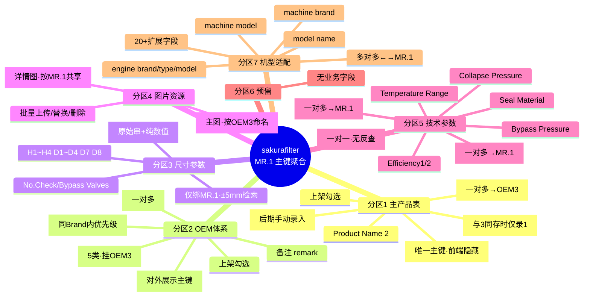
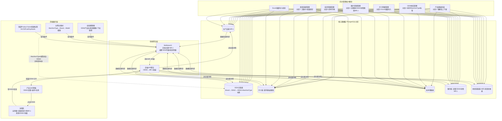

# sakurafilter 新架构方案梳理

> 基于《更新思路.xlsx》(客户 2026-07 版)整理,作为前后端统一基准文档。

---

## 一、架构总览

### 核心思路

以 **MR.1(自有产品编码)** 为唯一主键,串联 OEM 体系、机型体系、参数体系、图片资源;前端做「双维度分类导航 + 全局检索 + 详情展示」,后端按 7 个分区做模块化数据管理,检索层基于 Meilisearch 实现多维度联动匹配。

### 技术栈

| 层级 | 技术选型 | 说明 |
|------|---------|------|
| 数据库 | PostgreSQL | 按 Type 分区(20+ 分区),支持百万级 MR.1 + 千万级关联 |
| 检索引擎 | Meilisearch | 文档主键 = MR.1,嵌套 OEM/机型/参数全量数据 |
| 图片存储 | MinIO(MVP)/ 阿里云 OSS | 切换式存储 |
| 后端 | .NET + EF Core | 模块化 6 大管理区 |
| 前端 | Vue3 + 组件库 | 双维度筛选 + 全局检索 |

---

## 二、数据模型(7 个分区)

### 分区 1 主产品表(主键:MR.1)

| 字段 | 录入方式 | 关联规则 |
|------|---------|---------|
| MR.1 | 手动录入,支持模糊 | 唯一主键,一对多→OEM3;前端隐藏 |
| Product Name 1 | 模糊+下拉 | 与 Product Name 3 同存时仅录 1 |
| Product Name 2 | 模糊+下拉 | — |
| Type | 后期手动录入,模糊+下拉 | — |
| OEM 2 | 前期自动/后期手动,模糊 | 一对多→OEM3 |
| 上架 | 勾选框 | 控制前端可见性 |

### 分区 2 OEM 体系(三级层级 + 场景标签)

| 字段 | 录入方式 | 关联规则 |
|------|---------|---------|
| OEM Brand | 模糊+下拉 | 一对多→OEM2、OEM3;与 Machine Brand 隔离 |
| OEM 3 | 前期自动/后期手动 | 多对一→MR.1;对外展示主键 |
| 上架 | 勾选框 | — |
| 备注 remark | 文本 | 对应产品区 remark |
| 排序 | 按 OEM Brand 排序 OEM3 | 同 Brand 内决定前端优先展示顺序 |
| Machine Type | 模糊+下拉(挂 OEM3) | 5 类:agriculture / commercial vehicle / construction equipment / industrial / others;前端按此勾选是否展示与排序 |

### 分区 3 尺寸参数表(绑定 MR.1)

| 字段 | 特殊处理 |
|------|---------|
| H1 / H2 / H3 / H4 | 可能含特殊字符 |
| D1 / D2 / D3 / D4 / D7 / D8 | 可能含特殊字符 |
| No. Check Valves | 可能含特殊字符 |
| No. Bypass Valves | 可能含特殊字符 |

**绑定规则**:所有尺寸仅对应 MR.1,同 MR.1 下所有 OEM3 共享同一套尺寸。
**特殊处理**:
- 字段允许含特殊字符,检索时自动清洗数值
- 支持 ±5mm(用户可调 ±1/±5/±10)范围匹配
- 存储双列:原始字符串(展示用) + 纯数值(检索用)

### 分区 4 图片资源表

| 字段 | 命名规则 | 关联 |
|------|---------|------|
| 图片 1(主图) | 按 OEM3 编号命名 | 1 个 OEM3 → 1 张主图(**待客户确认**) |
| 图片 2 | 仅对应 MR.1 | 同 MR.1 下所有 OEM3 共享 |
| 图片 3 | 仅对应 MR.1 | 共享 |
| 图片 4 | 仅对应 MR.1 | 共享 |
| 图片 5 | 仅对应 MR.1 | 共享 |
| 图片 6 | 仅对应 MR.1 | 共享 |

**操作**:前期自动添加文件夹图片,后期可增删/替换。

### 分区 5 技术参数表(绑定 MR.1)

| 字段 | 关联规则 |
|------|---------|
| Media Name | 一对多→MR.1(同一滤材对应多个 MR.1) |
| Media Model | 一对多→MR.1 |
| Bypass Valve Setting (LR) | 一对一,无反查关系 |
| Bypass Valve Setting (HR) | 一对一,无反查关系 |
| Efficiency 1 | 一对一,无反查关系 |
| Efficiency 2 | 一对一,无反查关系 |
| Δ Collapse Pressure | 一对一,无反查关系 |
| Seal Material | 一对一,无反查关系 |
| Temperature Range | 一对一,无反查关系 |
| Bypass Pressure | 一对一,无反查关系 |

所有字段可能含特殊字符。

### 分区 6 预留区

Excel 标注「无需逻辑关系」。

**处理方案**(**待客户确认**):前端不展示,后端空表占位,不纳入主链路。

### 分区 7 机型适配表

| 字段 | 录入方式 | 关联规则 |
|------|---------|---------|
| machine brand | 自动/手动,模糊 | 反查该 brand 下所有 MR.1/OEM2/OEM3 |
| machine model | 自动/手动,模糊 | 反查该 brand 下所有 MR.1/OEM2/OEM3 |
| model name | 自动/手动,模糊 | 反查该 brand 下所有 MR.1/OEM2/OEM3 |
| Engine brand | 自动/手动,模糊 | 反查该 brand 下所有 MR.1/OEM2/OEM3 |
| Engine type | 自动/手动,模糊 | 反查该 brand 下所有 MR.1/OEM2/OEM3 |
| Engine energy | — | — |
| Production date | — | — |
| Power | — | — |
| Serial number (from/to) | — | — |
| Car body type | — | — |
| Series | — | — |
| CO₂ emission standard | — | — |
| Transmission type | — | — |
| Engine displacement | — | — |
| Number of cylinders | — | — |
| GVWR | — | — |
| Tonnage | — | — |
| Geographic area | — | — |
| Chassis type | — | — |
| Engine model | — | — |
| Cabin type | — | — |
| Capacity | — | — |
| Engine serial number | — | — |

**关联规则**:1 个机型 ↔ 多个 MR.1(多对多),支持品牌/型号反查所有适配滤芯。

---

## 三、前端页面逻辑

### 1. 全局框架(所有页面通用)

- **顶部导航栏**:About us / Product / News / Contact us + 全局搜索框
  - 搜索框支持:Product Name 1/2、OEM 2/3、OEM Brand、Machine Brand/Model 模糊输入
  - 下拉联想推荐,实时响应
- **左侧固定侧边栏(Catalog)**:按 Machine Type 维度级联分类
  - 一级:5 大应用场景
  - 二级:对应场景下的 Machine Brand 列表
  - 三级:对应品牌下的 Machine Model 列表
  - 点击任意层级,右侧产品区联动筛选

### 2. 产品列表页(首页 / 分类页)

- **顶部补充**:按 Product Name 维度的快捷标签(Air Filter / Oil Filter / Fuel Filter / Hydraulic Filter)
  - 与左侧分类形成**双维度交叉筛选**
- **产品卡片网格**:
  - 每张卡片展示:OEM 3 主图 + OEM 3 编号 + 产品名称
  - 同一 MR.1 下的多个 OEM 3,按后台排序号依次展示
- **筛选联动逻辑**:
  - 选左侧 Machine Type → 过滤该场景下所有机型 → 匹配对应 MR.1 → 展示其下所有上架 OEM 3
  - 选顶部 Product Name → 在当前结果中二次过滤产品类型
  - 全局搜索 → 命中 OEM / 产品名 / 机型后,直接跳转对应结果列表

### 3. 产品详情页(下级页面)

- **标题规则**:OEM 3 编号 + Product Name 1 + Product Name 2
- **左侧**:产品主图 + 详情图轮播
  - 主图用当前 OEM 3 专属图
  - 详情图复用 MR.1 公共图
- **右侧核心参数区**:H1/H2/H3、D1/D2/D3 等核心尺寸(精简展示,完整参数可展开)
- **下方适配信息区**:
  - 适配 Machine Brand、Machine Model、Engine Brand、Engine Type
  - 同 MR.1 下的其他 OEM 3 编号推荐
- **底部**:询盘引导文案(质量、价格、MOQ、交期)

---

## 四、后端管理逻辑(6 个模块)

| 模块 | 对应分区 | 核心功能 |
|------|---------|---------|
| 产品基础信息管理 | 分区 1 | 新增/编辑/上下架 MR.1 主产品;Product Name 1 自动同步关联 OEM3 展示名 |
| OEM 体系管理 | 分区 2 | OEM Brand 管理、OEM 3 批量导入、拖拽排序、上下架、Machine Type 标签批量设置;OEM3 唯一性校验 |
| 尺寸参数管理 | 分区 3 | 按 MR.1 录入/编辑尺寸;Excel 批量导入自动匹配 MR.1;录入时清洗数值(原始串+纯数值双存储) |
| 图片资源管理 | 分区 4 | OEM3 主图按文件名自动匹配;MR.1 详情图按编码批量上传;单张替换/删除/排序 |
| 技术参数管理 | 分区 5 | 按 MR.1 录入滤材/压力/精度/密封/温度等;滤材字典独立维护(Media Name/Model 下拉选择) |
| 机型适配管理 | 分区 7 | 维护 Machine Type→Brand→Model 三级树;批量绑定 MR.1 滤芯;补充发动机/吨位/排放等扩展信息 |

模块间通过 MR.1 / OEM 3 主键关联,避免重复录入。

---

## 五、检索与联动规则

### 1. 全局模糊检索(Meilisearch 承载)

- **索引主键**:MR.1,嵌套 OEM 列表、机型列表、全量参数
- **命中范围**:Product Name、OEM 2/3、OEM Brand、Machine Brand/Model、发动机型号
- **特性**:自带拼写容错(OEM 编号输错字母/数字仍可命中);输入时实时下拉联想

### 2. 左侧分类级联筛选

- **路径**:Machine Type → Machine Brand → Machine Model
- **逻辑**:逐级缩小范围 → 最终匹配对应 MR.1 → 展开其下所有上架 OEM 3

### 3. 尺寸范围检索

- **触发**:高级筛选区输入任意尺寸值(如 D1=80)
- **规则**:自动匹配该尺寸 ±5mm 范围内所有 MR.1,支持多尺寸叠加
- **实现**:清洗后纯数值字段做区间查询,原始带字符字段仅用于详情展示

### 4. OEM 双向查询

- **正向**:输 MR.1 → 查出所有关联 OEM 3、OEM 2、OEM Brand
- **反向**:输 OEM 3 → 查出对应 MR.1、全套参数、适配机型
- **前端展示**:MR.1 编号全程隐藏,仅用 OEM 3 作为对外展示标识

### 5. 排序与上架规则

- **OEM 3 列表默认排序**:先按 OEM Brand 分组,组内按后台设置排序号升序
- **上下架控制**:「OEM 3 上架 + 对应 MR.1 上架」同时满足,才会在前端展示

---

## 六、架构图

### 6.1 数据模型思维导图

### 6.2 前后端串联流程图

---

## 七、落地注意事项

1. **数据主键统一**:所有关联必须用 MR.1 和 OEM 3 两个核心 ID,禁止用产品名/品牌名做关联,避免重名混乱。
2. **OEM Brand 与 Machine Brand 隔离**:字段名直接用 `oem_brand` / `machine_brand`,分开存储、分开建索引,即使名称重复也互不干扰。
3. **特殊字符兼容**:尺寸字段存双份——原始字符串(展示用)+ 纯数值(检索用),解决 ±5mm 查询精度问题。
4. **Meilisearch 索引设计**:以 MR.1 为文档单位,把 OEM 列表、机型列表、参数全部嵌套进去,一次检索即可命中并返回完整关联信息,减少接口请求。
5. **批量导入校验**:Excel 导入时强制校验 MR.1/OEM 3 唯一性、尺寸数值格式,错误数据高亮提示,从源头保证数据质量。
6. **Machine Type 归属风险**:Excel 把它挂 OEM3 作为标签,但前端左侧三级级联需要它作为机型维度。详见第八章待确认事项。

---

## 八、待客户确认事项(正式建表前最后一轮确认)

> 以下 3 个细节确认后即可进入数据库建模阶段。

### 确认点 1:Machine Type(应用场景分类)归属

**现状**:Excel 中 Machine Type 挂在分区 2 的 OEM3 后面作为标签。

**前端诉求**:需要作为左侧分类树的顶级分类(Agriculture / Commercial Vehicles / Construction Equipment / Industrial / Others)。

**两种实现方案**:

| 方案 | 说明 | 优劣 |
|------|------|------|
| A(现状) | Machine Type 仅挂在 OEM3,前端通过 OEM3→适配机型反查生成分类树 | 无需机型表冗余字段;但级联查询链路长 |
| B(建议) | 机型表也直接标注 Machine Type 字段,与 OEM3 标签双轨 | 分类逻辑直观、维护方便、查询快;但有数据冗余 |

**问题**:您倾向哪种方案?(建议方案 B,后期维护更便利)

### 确认点 2:图片 1(主图)命名与归属规则

**我们的理解**:每个 OEM3 编号对应一张独立主图(例如同 MR.1 下 OEM3-A 一张主图、OEM3-B 另一张主图)。

**备选方案**:同一 MR.1 下所有 OEM3 共用一张主图。

**问题**:请确认采用哪种方案?(建议方案 A,主图粒度更细、客户体验更好)

### 确认点 3:分区 6 处理

**Excel 标注**:"无需逻辑关系"。

**我们的处理**:前端不展示,后端空表占位,不纳入主链路。

**问题**:此处理方式是否可以?

---

> **确认完以上 3 点,即可开始数据库建模与开发实施。**
